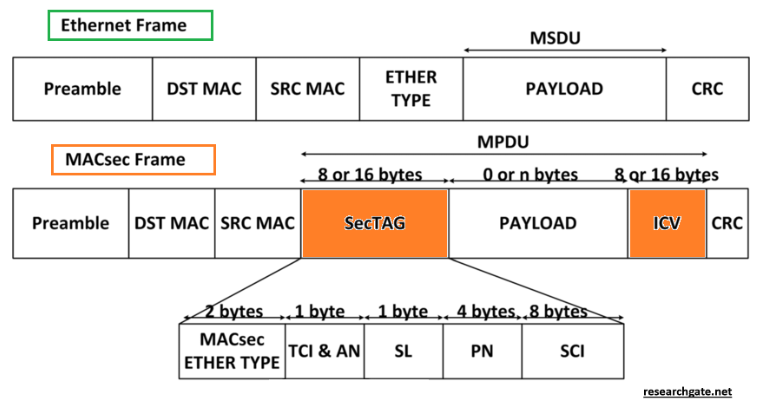

# MACSEC in UBUNTU

\

(main source: [MACsec Explained and Configuration Example - Learn
Duty](https://learnduty.com/network-techs/macsec-explained-and-configuration-example/))

MACsec (IEEE 802.1AE standard) is a network security standard that
operates at Layer 2 (MAC layer) and defines confidentiality and integrity
of connectionless data for protocols independent of access to the
medium.

It is similar to the Ethernet frame, but includes additional fields:

The MACsec Ethertype field is 2 bytes long, as is the
normal Ethertype field. Its value is 0x88e5 to indicate that it is
a MACsec frame:

- • • ICV: The ICV provides verification of
  frame integrity and is usually 8 to 16 bytes long,
  depending on the cipher suite. Frames that do not match
  the expected ICV are discarded at the port.
- SecTAG: The security tag has a
  length 8 to 16 bytes and identifies the SAK key to be used
  for the plot. With SCI (Channel Identifier) coding
  Secure), the security tag is 16 bytes long; without
  encoding, has a length of 8 bytes. TCI/AN: The third octet
  corresponds to the Label Control Information field
  (TCI)/Association Number. The TCI designates the version number of
  MACsec if only confidentiality or security are used.
  integrity.
- SL: The fourth octet corresponds to the length
  short, which corresponds to the length of the encrypted data.
- PN: Octets 5 to 8 represent the
  package number and are used for protection against
  reproduction and construction of the initialization vector (along with
  the secure channel identifier \[SCI\]).
- SCI: Octets 9 to 16 represent the
  secure channel identifier. Each connectivity association (CA) is
  a virtual port, and each virtual port is assigned a
  secure channel identifier, which is the concatenation of the address
  MAC of the physical interface and a 16-bit port ID.

## MACsec terms

- • MKA (MACSec Key Agreement): protocol
  key agreement to discover MACsec pairs and negotiate keys.
  Represents the MACsec peer control protocol.
- CA (Connectivity Association): connection relationship
  security established and maintained by key agreement protocols
  (MKA). The encryption key used by CA participants is
  called CAK (connectivity association key).
- 

After generating the CAK, two
keys:

-  Key Encryption Key (KEK): key
  to protect and encrypt MACsec keys (encrypt the SAK).
- Connection Integrity Key (ICK): key
  to check the integrity of each MKPDU sent between two peers. If
  label on each data/control frame to demonstrate that the frame
  comes from an authorized peer.
- CKN (CAK Key Name): used to
  configure the key value or CAK. Only up to 64 are allowed
  hexadecimal characters. The CKN identifies the CAK.

MACsec is supported by Linux kernels starting with version
4.6.

To check the kernel version:

  uname -r

To see if that kernel supports MACSEC:

  grep -i macsec /boot/config-6.6.11_1

If you return CONFIG_MACSEC=m, the
kernel is more than enough.

SHORTCUT: To check if the MACsec module is available it is also
possible using the modprobe command, trying to load the module
MACsec. If the module loads without errors, the kernel supports MACsec.

  sudo modprobe macsec

To verify that the module is loaded:

  lsmod | grep macsec

## Related tools

The macsec-tools package includes several useful tools for
configure and manage MACsec on Linux systems.

  sudo apt-get install macsec-tools

Here is a list of some of the main tools that
you can find in this package 1:

- • macsec: Main utility to configure
  and manage MACsec interfaces.
- ip macsec: Command of the ip tool that
  Allows you to add, modify and delete MACsec configurations in
  network interfaces.
- wpa_supplicant: Although it is not a direct part of
  macsec-tools, is frequently used in combination with MACsec to
  manage authentication and encryption.

These tools allow you to configure layer 2 security on your
network interfaces, ensuring that communication between your machines
virtual is encrypted and authenticated.

