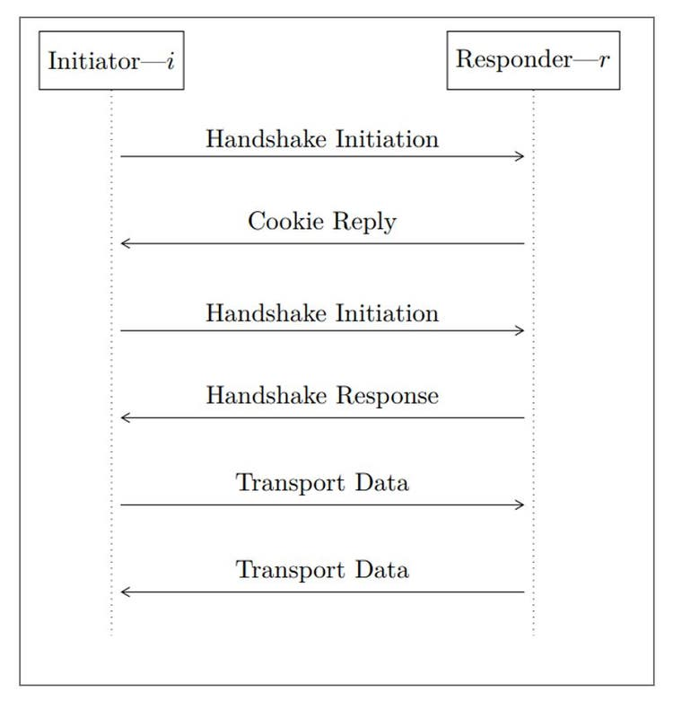
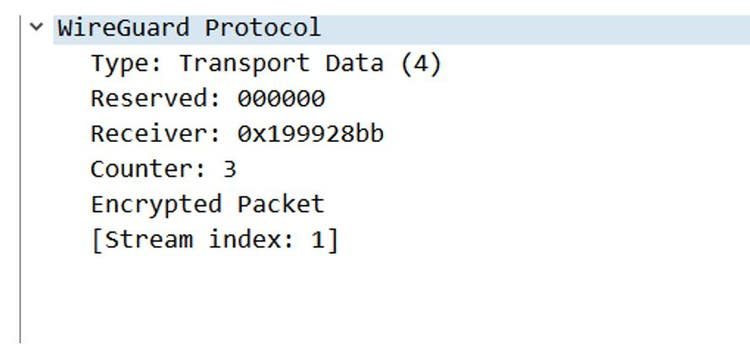
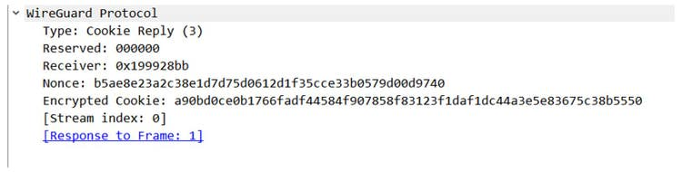

# DataFlow of WireGuard

\

# Key Exchange

*Fig.
4: Message Exchange in WireGuard*

WireGuard uses the Noise_IK handshake provided by the Noise Protocol.
This handshake is based around Diffie-Hellman Key Exchange.

In this process, a set of ephemeral Diffie-Hellman keypair are generated
for each peer in each handshake. These peers would also have the static
keypair, which has been shared previously.

The Diffie-Hellman calculations are done using the combination of these
keypairs, to generate shared session keys which are used to encrypt and
decrypt the communication on a particular session.

This key exchange is 1-RTT in nature, requires no certificate exchanges
and is carried out by just exchanging a 32-byte base64 encoded public
key.

### Message Types

WireGuard has the following packet message types:

-Handshake Initiation
-Handshake response
-Transport Data Packet
- Cookie Reply Packet

Let us take a look individually:

### A. Handshake Initiation

This is the first packet that the peer, referred to as the initiator
sends. It holds a unique index associated with the initiator, an
unencrypted Diffie-Hellman ephemeral public key and the encrypted static
public key among other fields.

*Fig.
5: Handshake Initiation Packet in Wireshark*

It also contains the MAC (Message Authentication Code) fields, which are
used with cookies to mitigate CPU-exhaustion attacks. It is important to
take care of such attacks because the Diffie-Hellman calculations can be
CPU intensive and bad-faith actors can take advantage of it. The ReDoS
attack is a notable example of it.

### B. Handshake Response

After the initiation, a response is sent from the responder to the
initiator which again holds an unencrypted ephemeral public key
generated by the responder. It also contains an empty buffer, which has
been encrypted using a key that is calculated based on the ephemeral
private key and the static key of the initiator.

*Fig.
6: Handshake Response Packet in Wireshark*

### C. Transport Data Packet

After the handshake packets are exchanged, shared session keys are
calculated based on the exchanged data. There are two session keys, one
for encrypting data that is about to be sent and another for decrypting
data that has been received. Both the initiator and the responder have
these session keys in their state.

*Fig.
7: Transport Data Packet in Wireshark*

WireGuard works over UDP which is an unreliable protocol where messages
can sometimes appear out-of-order. We don't want that because that could
lead to scenarios such as the protocol trying to decrypt a message
without a key exchange beforehand. Awkward.

To take care of that, WireGuard uses a counter field in the data packets
paired with an internal sliding window to keep track of the packets that
have been received. This counter field is always incremented by 1.

### D. Cookie Reply Packet

As mentioned earlier, WireGuard uses MAC fields in the handshake packets
for security reasons. If the responder is ever under load from the CPU
intense calculations that are happening in after the Handshake
Initiation packet, it may choose to not go ahead with sending a
Handshake Response packet, but instead can respond with a Cookie Reply
packet.

*Fig.
8: Cookie Reply Packet in Wireshark*

This packet contains a cookie that is calculated using the BLAKE2 hash
function with two inputs: a secret random value maintained by the
respond that changes every 120 seconds, and the IP address of the
initiator.

Upon receiving this cookie packet, the initiator must store the
decrypted cookie value and wait for a certain amount of time before
attempting a handshake again with the MAC value obtained from the last
cookie.

Further details can be found in the

##  

[official documentation](https://www.wireguard.com/protocol/)

